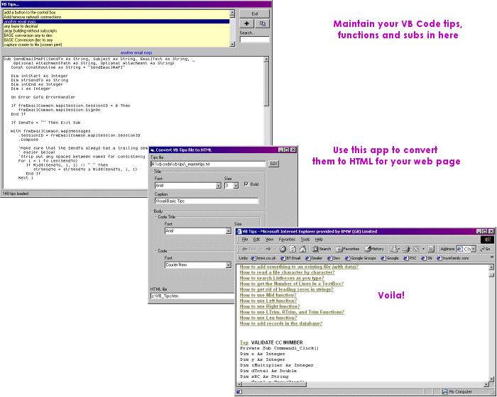

## Manage your code snippets AND generate an HTML bookmarked page with them\! 2 Apps\!

### Description

Two Applications in one submission!

Manage your code tips, functions and subs in one app and the other will generate a web page from those code snippets with bookmarks. Just point a link from your site! couldn't be simpler!

150K code file supplied

please comment if you find this useful
 
### More Info
 

             |
---                |---
**Submitted On**   |2002-10-15 08:25:02
**By**             |[Qucami](https://github.com/Planet-Source-Code/PSCIndex/blob/master/ByAuthor/qucami.md)
**Level**          |Intermediate
**User Rating**    |4.9 (34 globes from 7 users)
**Compatibility**  |VB 6\.0, ASP \(Active Server Pages\) 
**Category**       |[Complete Applications](https://github.com/Planet-Source-Code/PSCIndex/blob/master/ByCategory/complete-applications__1-27.md)
**World**          |[Visual Basic](https://github.com/Planet-Source-Code/PSCIndex/blob/master/ByWorld/visual-basic.md)
**Archive File**   |[Manage\_you14795410182002\.zip](https://github.com/Planet-Source-Code/qucami-manage-your-code-snippets-and-generate-an-html-bookmarked-page-with-them-2-apps__1-39934/archive/master.zip)

